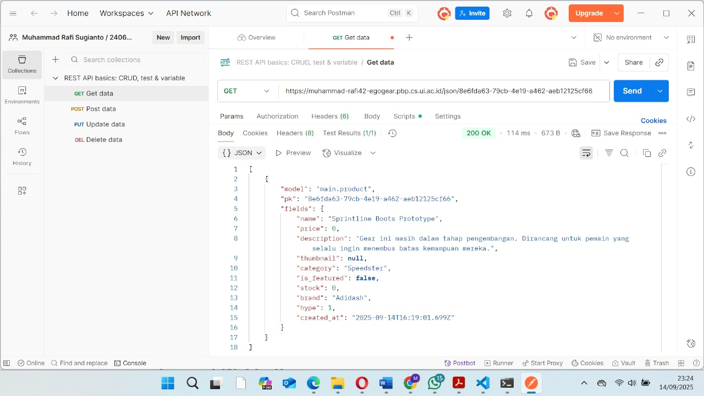
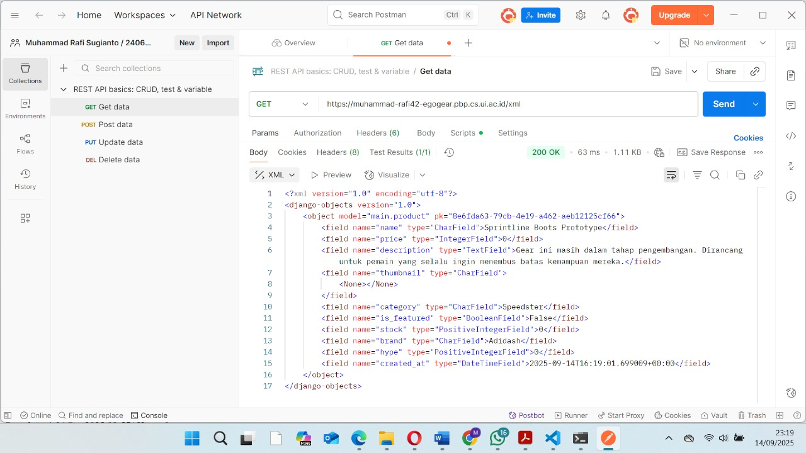
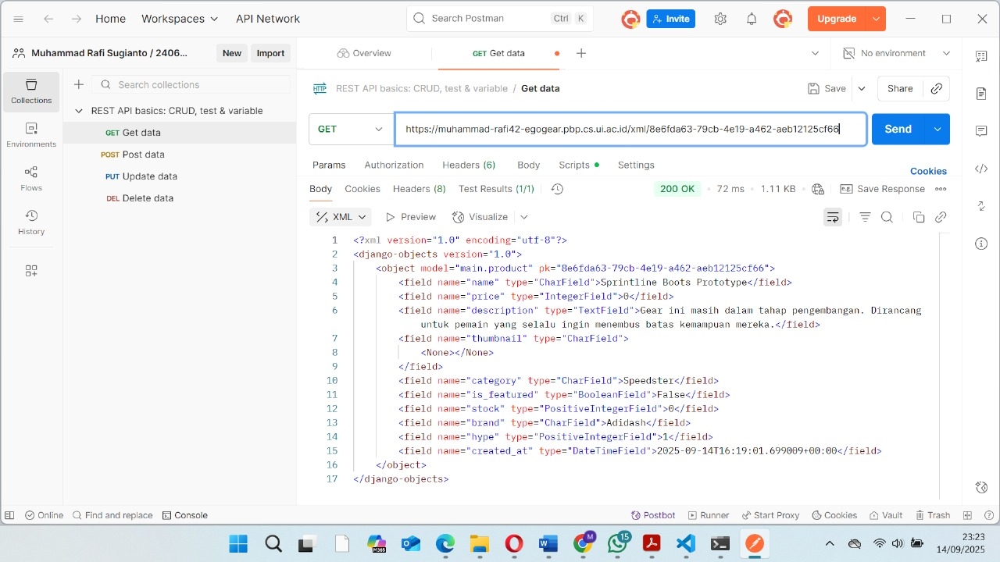
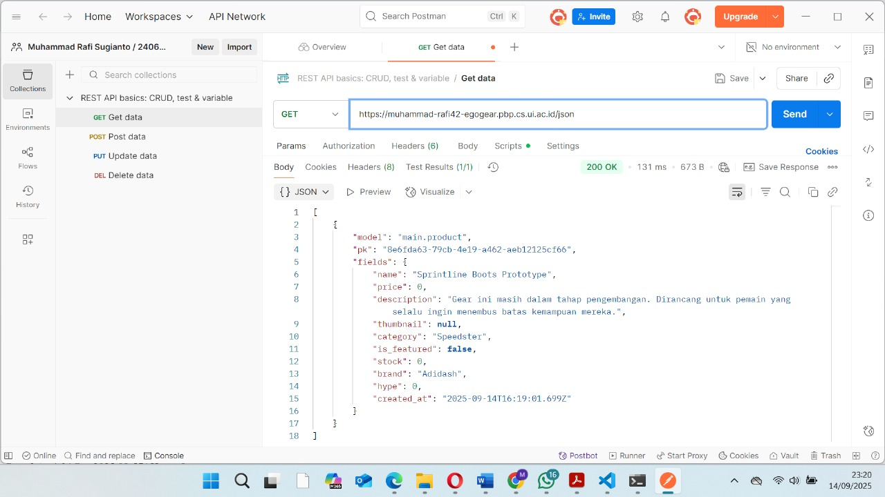

Muhammad Rafi Sugianto / PBP B / 2406357135

<b>Tugas 2</b>

[TUGAS 2]

0. Membuat sebuah README.md yang berisi tautan menuju aplikasi PWS yang sudah di-deploy

Tautan: https://muhammad-rafi42-egogear.pbp.cs.ui.ac.id/

-----------------------------------------------------------------------------------------------

1. Jelaskan bagaimana cara kamu mengimplementasikan checklist di atas secara step-by-step (bukan hanya sekadar mengikuti tutorial).

Jawab: 
Langkah pertama yang saya lakukan untuk mengimplementasikan checklist diatas adalah memikirkan konsep tugas saya. Dalam tugas individu kali ini, saya memikirkan sebuah toko peralatan sepakbola yang terinspirasi dari fiksi "Blue Lock". Toko ini dikhususkan untuk pemain ambisius yang menjadikan ego mereka sebagai bahan bakar utama, bernama EGO Gear.

Kemudian, langkah selanjutnya saya memulai membuat django project untuk Ego Gear. Saya membuat direktori baru bernama ego-gear dan menambahkan requirements.txt di dalamnya. requirements.txt ini akan berisi dependencies, yaitu komponen, library, framework, atau modul eksternal yang dibutuhkan oleh suatu program bisa berjalan. Kemudian, saya mengaktifkan virtual environment dan menginstall dependencies yang dicantumkan di requirements.txt tadi.

Selanjutnya, saya membuat django project dengan perintah "django-admin startproject ego_gear ." , dengan ini saya telah mengimplementasikan checklist pertama, yaitu "Membuat sebuah proyek Django baru"

Langkah berikutnya adalah mengonfigurasi environment variables. Saya membuat .env dan menambahkan konfigurasi PRODUCTION=false agar django tahu kalau saya sedang di mode development lokal. Saya juga menambahkan .env.prod dan mengisi dengan konfigurasi produksi seperti nama database, host database, dst. Hal ini bertujuan agar pada saat projek django tsb dijalankan di server, dia akan tahu ini pakai database yg mana, skema apa yg digunakan (misal tutorial, tugas individu), dan tahu kalau ini production mode.

Kemudian, saya memodifikasi settings.py agar django bisa baca konfigurasi dari file .env / .env.prod (seperti DB_NAME, DB_USER, PRODUCTION). Saya menambahkan "localhost" dan "127.0.0.1" agar mengizinkan django menerima request dari alamat lokal. Saya juga menambahkan konfigurasi di settings.py agar django bisa membedakan apakah dia sedang running di development atau production, berdasarkan isi file .env. Selain itu juga dilakukan konfigurasi agar django bisa otomatis memilih database berdasarkan environment (PRODUCTION=True atau False), misal ketika PRODUCTION=True maka pakai PostgreSQL dengan kredensial dari .env.prod., sedangkan kalau PRODUCTION=False maka pakai pakai SQLite (file database lokal).

Pada langkah selanjutnya, saya menjalankan perintah python manage.py runserver untuk menerapkan migration django ke database. Migrasi bertujuan supaya struktur database selalu sesuai dengan model yang tertulis di kode. Misalnya ketika menambahkan model baru atau mengubah field di models.py, django tidak otomatis mengubah database. Saat menjalankan python manage.py migrate, django membaca file-file migrasi yang sudah dibuat sebelumnya dan kemudian menerapkan perubahan itu ke database.

Langkah berikutnya yang saya lakukan selanjutnya adalah melakukan push ke github. Sebelum itu tentunya saya telah membuat repo baru di github dan menginisiasi direktori saya sebagai repo git. Saya juga menambahkan file .gitignore agar berkas-berkas yang dicantumkan tidak ikut di-push ke git.

Selanjutnya, saya mengakses https://pbp.cs.ui.ac.id/ dan membuat proyek baru bernama egogear. Saya menyimpan environment variable dan menambahkan url deployment saya pada ALLOWED_HOSTS (settings.py). Saya menjalankan perintah yang terdapat pada informasi project command dan melakukan deployment ke PWS. Dengan melakukan langkah ini saya telah mengimplementasikan checklist ke-tujuh, yaitu "Melakukan deployment ke PWS terhadap aplikasi yang sudah dibuat sehingga nantinya dapat diakses oleh teman-temanmu melalui Internet."

Setelah menyelesaikan rangkaian pembuatan proyek django hingga deployment di atas, selanjutnya saya melangkah ke proses pembuatan aplikasi main. Saya menjalankan perintah "python manage.py startapp main" dan mendaftarkan aplikasi main di settings.py. Hal ini dilakukan dengan menambahkan 'main' ke dalam variabel INSTALLED_APPS. Dengan begitu saya telah mengimplementasikan checklist ke-dua, yaitu "Membuat aplikasi dengan nama main pada proyek tersebut".

Langkah selanjutnya adalah melakukan implementasi dengan html. Saya membuat direktori templates di dalam direktori main, dan menambahkan main.html di dalam direktori templates. Saya mengisi main.html dengan konten sederhana berupa heading yang menampilkan nama toko "EGO Gear" dan isian berupa nama dan kelas. 

Setelah selesai dengan html, saya menyiapkan model yang akan saya gunakan. Berdasarkan deskripsi tugas, model harus mengikuti beberapa ketentuan, yaitu memiliki nama Product, dan memiliki atribut wajib sebagai berikut:
- name sebagai nama item dengan tipe CharField.
- price sebagai harga item dengan tipe IntegerField.
- description sebagai deskripsi item dengan tipe TextField.
- thumbnail sebagai gambar item dengan tipe URLField.
- category sebagai kategori item dengan tipe CharField.
- is_featured sebagai status unggulan item dengan tipe BooleanField.

Untuk mengimplementasikannya, saya menambahkan model sebagai berikut di dalam model.py:

class Product(models.Model):
    id = models.UUIDField(primary_key=True, default=uuid.uuid4, editable=False)
    name = models.CharField(max_length=100)                 
    price = models.IntegerField()                           
    description = models.TextField()                        
    thumbnail = models.URLField(blank=True, null=True)      
    category = models.CharField(max_length=100)              
    is_featured = models.BooleanField(default=False)        
    stock = models.PositiveIntegerField(default=0)
    brand = models.CharField(max_length=50, blank=True, null=True)
    rating = models.FloatField(default=0.0)

    def __str__(self):
        return f"{self.name} - {self.category}"

Pada model tersebut saya menambahkan beberapa atribut pelengkap seperti stock, brand, dan rating. Pada step ini, saya telah mengimplementasikan checklist ke-empat, yaitu "Membuat model pada aplikasi main". Saya juga telah menjalankan migrasi pada model dengan perintah "python manage.py makemigrations" dan "python manage.py migrate"

Langkah selanjutnya yang saya lakukan adalah menghubungkan view dengan template. Tujuan dari tahap ini adalah agar data dari database bisa ditampilkan dengan template, hal ini memerlukan perantara dari views (views.py). Saya menambahkan fungsi show_main di views.py yang akan menerima http request dan mengembalikan respons berupa halaman html. Pada fungsi ini data-data yang ingin ditampilkan di template berupa nama toko, nama mahasiswa, dan kelas akan di-hardcode pada dictionary, jadi views tidak mengambil datanya langsung dari database. Dengan melakukan langkah ini, saya telah mengimplementasi checklist ke-lima, yaitu "Membuat sebuah fungsi pada views.py untuk dikembalikan ke dalam sebuah template HTML yang menampilkan nama aplikasi serta nama dan kelas kamu."

Selanjutnya adalah tahap routing url project. Tahap ini dibagi menjadi routing url pada tingkat proyek dan routing url pada tingkat aplikasi. Pada tingkat proyek, routing url dilakukan dengan menambahkan "path('', include('main.urls'))" pada urls.py tingkat proyek. Tahap ini berfungsi agar saat ada request ke root proyek (''), teruskan ke routing yang ada di aplikasi main. Secara sederhana, routing pada tingkat proyek berfungsi sebagai gerbang utama yang memutuskan aplikasi mana yang akan menangani request. Kemudian tahap berlanjut ke routing tingkat aplikasi.

Routing pada tingkat aplikasi dilakukan dengan membuat berkas urls.py pada direktori main. Kemudian saya mengimpor fungsi path dari django, path digunakan untuk mendefinisikan pola url dan menentukan view mana yang dijalankan saat url itu diakses. Pada urls.py tsb saya mendefinisikan path dengan path('', show_main, name='show_main'). Sehingga, jika ada request ke root aplikasi, django akan memanggil fungsi show_main untuk menyiapkan data dan merender template. 

Dengan dua langkah tersebut, saya telah mengimplementasi checkpoint ke-tiga dan ke-enam, yaitu "Melakukan routing pada proyek agar dapat menjalankan aplikasi main." dan "Membuat sebuah routing pada urls.py aplikasi main untuk memetakan fungsi yang telah dibuat pada views.py."

-----------------------------------------------------------------------------------------------

2. Buatlah bagan yang berisi request client ke web aplikasi berbasis Django beserta responnya dan jelaskan pada bagan tersebut kaitan antara urls.py, views.py, models.py, dan berkas html.

Jawab: 

Penjelasan: Request dari client pertama kali masuk ke urls.py tingkat proyek untuk dicek aturan routingnya. Jika ada yang sesuai, request lanjut ke urls.py tingkat aplikasi. Dari sana, request diarahkan ke views.py. View bertugas memproses logika, bisa berinteraksi dengan models.py seperti membaca atau menulis data ke database. Setelah data siap, view memanggil template untuk merender data tsb ke dalam bentuk HTML. Hasil render template ini kemudian dikirim kembali ke client sebagai HTTP response.

Kaitan antara urls.py, views.py, models.py, dan html adalah seagai berikut:
- urls.py akan menerima http request dan mengecek pola URL yang cocok, kemudian menunjuk ke fungsi yang ada di views.py.
- views.py bertugas mengerjakan logika dan memproses data dari database melalui models.py
- data yang telah diproses, views memanggil template berupa file .html untuk merender data tsb
- hasil render template dikirim kembali ke client sebagai http response

-----------------------------------------------------------------------------------------------

3. Jelaskan peran settings.py dalam proyek Django!

Jawab: Sesuai dengan namanya, settings.py berperan dalam mengatur bagaimana proyek berjalan, settings.py memastikan smeua komponen dalam proyek berjalan sesuai konfigurasi. Jika dalam kasus tugas individu kali ini, saya memanfaatkan peran settings.py sebagai pengatur perilaku proyek django agar sesuai dengan environment tempat dia dijalankan. settings.py bertugas membaca variabel dari .env atau .env.prod agar kredensial database dan mode aplikasi dipisahkan secara aman. settings.py juga berperan mengatur host mana saja yang boleh mengakses aplikasi, misalnya dengan menambahkan localhost dan 127.0.0.1 supaya request dari alamat lokal diterima. Selanjutnya , settings.py menentukan apakah aplikasi berjalan di development atau production dengan membaca variabel PRODUCTION, lalu memilih database yang sesuai, misal SQLite untuk development karena lebih sederhana, atau PostgreSQL dengan kredensial lengkap untuk production. Dengan begitu, settings.py berperan sebagai pengendali utama yang memastikan django bisa beradaptasi pada environmentnya.

-----------------------------------------------------------------------------------------------

4. Bagaimana cara kerja migrasi database di Django?

Jawab: Sebelum menjawab tentang cara kerja migrasi database, ada baiknya saya menjelaskan terlebih dahulu tentang database dan model. Database adalah tempat menyimpan data aplikasi yang tersusun dalam tabel dengan kolom dan baris, terstruktur, dan kuat untuk dipakai aplikasi.
Di django, kita tidak bisa langsung menulis tabel database, oleh karena itu digunakan model, yg merupakan representasi tabel database dalam bentuk class Python yang ditulis di models.py.

Migrasi adalah cara django untuk menerjemahkan perubahan di models.py menjadi instruksi yang mengubah struktur database. Django mencatat perubahan dalam file migrasi, lalu ketika dijalankan dengan perintah python manage.py migrate, Django akan mengeksekusi instruksi tersebut ke database sehingga tabel benar-benar dibuat atau diperbarui. Dengan begini kita bisa mengubah struktur data lewat kode Python (model), lalu melakukan migrasi agar perubahan itu sinkron dengan database.

-----------------------------------------------------------------------------------------------

5. Menurut Anda, dari semua framework yang ada, mengapa framework Django dijadikan permulaan pembelajaran pengembangan perangkat lunak?

Jawab: Menurut saya django dijadikan permulaan pembelajaran pengembangan perangkat lunak karena lebih mudah dipelajari dan menyediakan alur pengembangan yang lengkap. Selain itu framework django lebih umum digunakan oleh pemula dan video tutorialnya banyak ditemukan di internet, sehingga menjadikan django salah satu framework yang mudah dipelajari. 

-----------------------------------------------------------------------------------------------

6. Apakah ada feedback untuk asisten dosen tutorial 1 yang telah kamu kerjakan sebelumnya?

Jawab: Penjelasan tutorial sudah sangat baik dan lengkap karena tidak hanya menyediakan langkah yg harus dilakukan, melainkan juga menjelaskan kegunaan dari tiap kode serta konsep yang mendasarinya, makasih kak :D

<b>Tugas 3</b>

[TUGAS 3]

1. Jelaskan mengapa kita memerlukan data delivery dalam pengimplementasian sebuah platform?
 
Jawab: Sebelum menjawab pertanyaan ini, saya akan menjelaskan terlebih dahulu apa itu data delivery. Data delivery adalah proses mengirim atau menyampaikan data dari satu tempat ke tempat lain agar bisa digunakan. Dalam konteks ini, tempat bisa berupa database tempat data disimpan, server atau backend tempat data diproses, template HTML di frontend tempat data ditampilkan ke pengguna, atau sistem lain yg menerima data melalui API seperti JSON atau XML.

Data delivery diperlukan dalam pengimplementasian sebuah platform karena data harus sampai ke pihak atau sistem yang membutuhkannya. Data delivery memastikan informasi yang tersimpan di database atau di backend dapat berpindah ke frontend untuk ditampilkan, atau ke sistem lain melalui API agar bisa diproses lebih lanjut. Jika tidak ada data delivery, maka input dari pengguna, misal melalui form, tidak bisa tersimpan di server, dan data yg sudah ada di server tidak bisa diakses oleh pengguna maupun aplikasi lain karena tidak adanya pergerakan data. Data delivery adalah mekanisme yang membuat data bergerak ke tempat yang membutuhkannya, sehingga platform bisa berjalan dengan interaktif.

-----------------------------------------------------------------------------------------------

2. Menurutmu, mana yang lebih baik antara XML dan JSON? Mengapa JSON lebih populer dibandingkan XML?

Jawab: Menurut saya, JSON terasa lebih sederhana dan mudah dipahami dibanding XML. Misal ketika ingin melihat informasi tentang seseorang. Dengan JSON, data ditulis dalam format key value, misal:

 {"name": "Burhan", "age": 25"}
 
Menurut saya teks tersebut bisa langsung dimengerti bahwa nama orang itu Burhan dan usianya 25 tahun.

Sementara itu, dengan XML, informasi yang sama ditulis dengan tag pembuka dan penutup, misal:

 <person>
    <name>Burhan</name>
    <age>25</age>
</person>
 
Bagi orang yang tidak terbiasa dengan kode, tanda < > dan struktur yang terdiri dari banyak lapisan bisa membuat data terlihat lebih rumit untuk dibaca. JSON terlihat lebih ringkas, rapi, dan langsung ke inti informasi, sehingga lebih mudah dibaca dan dimengerti.

Selain karena kemudahan pembacaan yang saya sebutkan sebelumnya, ada beberapa alasan lain yang menjadikan JSON lebih populer dibandingkan XML. Diantaranya adalah karena JSON lebih efisien untuk dikirim lewat jaringan karena ukurannya lebih kecil dan lebih mudah diproses oleh bahasa pemrograman modern.

-----------------------------------------------------------------------------------------------

3. Jelaskan fungsi dari method is_valid() pada form Django dan mengapa kita membutuhkan method tersebut?

Jawab: Method is_valid() berfungsi untuk mengecek apakah data yang dikirim melalui telah memenuhi semua ketentuan yang ditetapkan. Dalam kasus tugas kali ini, karena form dibuat dari model menggunakan ModelForm, maka aturan yang sudah ditentukan di model otomatis diterapkan di form (misalnya menentukan tipe data dan jumlah karakter maksimal yang bisa dimasukkan di form).

Method ini diperlukan karena kita tidak ingin kasus seperti data kosong atau salah tipe tersimpan di database. Dengan is_valid(), kita memastikan hanya data yang benar dan sesuai aturan yang diterima dan diproses, sehingga aplikasi lebih aman dan data tetap konsisten.

-----------------------------------------------------------------------------------------------

4. Mengapa kita membutuhkan csrf_token saat membuat form di Django? Apa yang dapat terjadi jika kita tidak menambahkan csrf_token pada form Django? Bagaimana hal tersebut dapat dimanfaatkan oleh penyerang?

Jawab: Sebelum menjawab pertanyaan ini, saya akan menjelaskan terlebih dahulu apa yg dimaksud dengan CSRF token. CSRF token adalah kode unik yang dibuat oleh server dan disisipkan ke dalam form HTML untuk melindungi aplikasi dari serangan CSRF. Kode ini akan berfungsi sebagai tanda pengenal rahasia untuk memastikan request yang dikirim ke server berasal dari pengguna asli dan dari aplikasi itu sendiri, bukan dari pihak ketiga. 

Serangan CSRF itu sendiri adalah jenis serangan di mana penyerang mencoba membuat request palsu ke server menggunakan sesi login pengguna tanpa sepengetahuan pengguna. Oleh karena itu kita membutuhkan csrf_token saat membuat form di Django. Dengan menambahkan  di form, Django akan menyisipkan token unik yang terkait dengan sesi pengguna. Token ini dikirim bersama data form ketika pengguna submit. Server kemudian akan memeriksa token tersebut. Jika token valid, request diproses, namun jika token tidak ada atau salah, request ditolak.

Jika kita tidak menambahkan csrf_toke pada form Django, maka server tidak bisa membedakan request asli dari request palsu. Sehingga setiap request yang datang dari browser pengguna dianggap sah.

Hal ini dapat dimanfaatkan oleh penyerang dengan membuat halaman web jahat yang terlihat normal. Misalkan pengguna membuka halaman itu saat sedang login di situs lain yang tidak menerapkan csrf_token, maka halaman jahat bisa mengirim perintah palsu ke situs yang dimana ia sedang login (misalnya memindahkan uang atau mengubah data tanpa disadari pengguna). Karena server mengira request berasal dari pengguna tsb, maka perintah palsu tadi bisa dijalankan.

-----------------------------------------------------------------------------------------------

5. Jelaskan bagaimana cara kamu mengimplementasikan checklist di atas secara step-by-step (bukan hanya sekadar mengikuti tutorial).

Jawab: 
Langkah pertama yang saya lakukan adalah membuat form sederhana untuk menginput produk baru pada aplikasi. Tapi sebelum itu, saya memberi beberapa perubahan pada model dengan menghapus beberapa atribut yang menurut saya tidak perlu, dan melakukan migrasi pada model. Selanjutnya untuk membuat form sederhana, saya menyiapkan sebuah class bernama ProductForm yang akan mewarisi ModelForm. Karena memakai ModelForm, form akan digenerate secara otomatis berdasarkan fields yg telah ditentukan. Selain itu, data yang diisi lewat form bisa langsung divalidasi dan disimpan sebagai objek product di database cukup dengan form.save(). 

Langkah selanjutnya yang saya lakukan adalah menghubungkan form dan data product dengan tampilan web. Saya mengimport beberapa fungsi bantu dari Django seperti render, redirect, dan get_object_or_404, masing2 berguna untuk merender template HTML, meredirect halaman setelah data tersimpan, dan mengambil objek dari database. 

Setelahnya, saya menambahkan .objects.all(), untuk mengambil semua product dari database, di fungsi show_main. Saya juga menambahkan fungsi create_product dan show_product. Fungsi create_product digunakan untuk menghasilkan form dimana pengguna dapat memasukkan data untuk product baru. Sementara show_product berguna untuk menampilkan product berdasarkan id, fungsi ini menggunakan get_object_or_404 sehingga akan mengembalikan halaman 404 ketika product tidak ditemukan. Saya mengimport kedua fungsi create_product dan show_product tersebut ke urls.py,dan menambahkan path urlnya di urlpatterns.

Berikutnya, saya melakukan implementasi skeleton pada kerangka views. Hal ini dilakukan supaya semua halaman pada tampilan web memiliki dasar yang sama. Saya menambahkan tag  dan  sebagai template dimana fitur unik tiap halaman diletakkan. Saya juga mengonfigurasi settings.py agar mendeteksi base.html sebagai file template.

Setelahnya, saya memperbarui main.html agar bisa menampilkan data product dan menambahkan tombol Add Product yang akan meredirect pengguna ke form. Kemudian saya membuat file create_product.html, yaitu form input data ketika menambahkan produk baru. Dengan ini, saya telah mengimplementasikan checklist ke-4, yaitu "Membuat halaman form untuk menambahkan objek model pada app sebelumnya." Saya juga membuat product_detail.html untuk halaman yang menampilkan detail produk. Dengan ini saya telah mengimplementasikan checklist ke-5, yaitu "Membuat halaman yang menampilkan detail dari setiap data objek model".

Pada rangkaian langkah tersebut juga saya telah mengimplementasikan checkpoint ke-3,yaitu "Membuat halaman yang menampilkan data objek model yang memiliki tombol "Add" yang akan redirect ke halaman form, serta tombol "Detail" pada setiap data objek model yang akan menampilkan halaman detail objek."

Selanjutnya, saya menambahkan url deployment saya pada CSRF_TRUSTED_ORIGINS di settings.pyHal ini dilakukan untuk memberitahu Django bahwa alamat website yang sudah kamu deploy adalah alamat yang aman dan dipercaya untuk menerima permintaan yang membawa CSRF token.

Setelah menyelesaikan fitur form dan menampilkan detail produk, saya lanjut ke menampilkan data dalam bentuk XML dan JSON. Untuk melakukan implementasi tersebut, saya mengimport HttpResponse, serializers, dan menambahkan 2 fungsi baru di views.py. Fungsi pertama, show_xml akan mengambil semua objek produk dalam database, dan menerjemahkannya menjadi format xml, kemudian mengembalikan seluruh data produk dalam format xml sebagai http response. Fungsi kedua, show_json, juga akan mengambil semua objek produk dalam database, namun menerjemahkannya menjadi format json, kemudian mengembalikan seluruh data produk dalam format json sebagai http response. 

Selanjutnya saya juga menambahkan 2 fungsi lagi, show_xml_by_id dan show_json_by_id, yg berfungsi untuk mengembalikan data dalam bentuk xml dan json, tapi berdasarkan id. Cara kerjanya sama dengan 2 fungsi sebelumnya, tapi kita tidak mengambil semua objek dalma database, melainkan melakukan filter berdasarkan id dengan news_item = News.objects.filter(pk=news_id). Setelah itu saya juga mengimport keempat fungsi tadi ke urls.py dan menambahkan pathnya di urlpatterns. Dengan ini, saya telah mengimplementasikan checklist pertama dan kedua, yaitu "Tambahkan 4 fungsi views baru untuk melihat objek yang sudah ditambahkan dalam format XML, JSON, XML by ID, dan JSON by ID." dan "Membuat routing URL untuk masing-masing views yang telah ditambahkan pada poin 1."

-----------------------------------------------------------------------------------------------

6. Apakah ada feedback untuk asdos di tutorial 2 yang sudah kalian kerjakan?

Jawab: Sejujurnya saya masih bingung tentang kegunaan postman selain membaca data dalam xml dan json, tapi selain itu penjelasan tutorial sudah sangat baik dan lengkap karena tidak hanya menyediakan langkah yg harus dilakukan, melainkan juga menjelaskan kegunaan dari tiap kode serta konsep yang mendasarinya, makasih kak :D

-----------------------------------------------------------------------------------------------

7. Mengakses keempat URL di poin 2 menggunakan Postman, membuat screenshot dari hasil akses URL pada Postman, dan menambahkannya ke dalam README.md.

Jawab:

 
 
 

<b>Tugas 4</b>

[TUGAS 4]

1. Apa itu Django AuthenticationForm? Jelaskan juga kelebihan dan kekurangannya.

Jawab:
Django AuthenticationForm adalah form bawaan Django untuk menangani login user.
Form ini akan berisi field username dan password. Ketika data form dikirim dengan POST, Django akan memeriksa apakah data valid dan kemudian mencocokkan username dan password dengan data user di database. Jika berhasil, kita dapat memanggil get_user() untuk mendapatkan objek User yg sudah terautentikasi dan kemudian melakukan login dengan fungsi login().

Kelebihan dari AuthenticationForm adalah mudah digunkan. AuthenticationFrom merupakan bagian dari sistem autentikasi Django, sehingga kita tidak perlu membuat form login dari nol.  AuthenticationFrom juga aman karena langsung pakai sistem autentikasi Django (misal untuk hash password, cek akun nonaktif). AuthenticationForm juga mudah dipakai dan bisa dicustom tampilan atau pesannya.

Daru segi kekurnagan, Django AuthenticationFrom memiliki tampilan yg polos, sehingga biasanya perlu diubah agar sesuai desain web. Selain itu Django AuthenticationForm hanya mendukung login username dan password, namun fitur tambahan  seperti login lewat email, OTP, dst harus dibuat manual.

-----------------------------------------------------------------------------------------------

2. Apa perbedaan antara autentikasi dan otorisasi? Bagaiamana Django mengimplementasikan kedua konsep tersebut?

Jawab: 
Autentikasi adalah proses memvalidasi identitas user atau sistem untuk memastikan bahwa ia benar-benar pihak yang valid. Biasanya dilakukan dengan membandingkan kredensial (misal username, password, OTP, dst) yang diberikan user dengan data yang sudah tersimpan di sistem.

Otorisasi adalah proses menentukan hak atau izin yang dimiliki user setelah identitasnya berhasil diverifikasi melalui autentikasi. 

Bagaimana Django mengimplementasikan kedua konsep tsb? Dalam mengimplementasikan autentikasi, Django menyediakan sistem bawaan yang terdiri dari model User, form dan view siap pakai (misal AuthenticationForm, LoginView, LogoutView), backend autentikasi, session, cookie, dan middleware (AuthenticationMiddleware, SessionMiddleware). Alurnya, misal ketika user login:
a. Form login dikirim ke server.
b. Django memanggil authenticate() untuk memeriksa kecocokan kredensial dengan data user di database.
c. Misal valid, login() membuat session di server dan mengirim cookie sessionid ke browser.
d. Pada request selanjutnya, middleware membaca session dan menempelkan objek user ke request.user, sehingga sistem selalu mengenali siapa user yg sedang aktif.

Sementara itu untuk otorisasi, Django akan menggunakan permission dan group untuk menentukan apa yang boleh dilakukan user. Setiap model secara default punya permission (add, change, delete, view), dan kita bisa membuat permission custom. Hak akses ini bisa dicek di view menggunakan decorator seperti @login_required, @permission_required, dst.

-----------------------------------------------------------------------------------------------

3. Apa saja kelebihan dan kekurangan session dan cookies dalam konteks menyimpan state di aplikasi web?

Jawab: 
Session dan cookies adalah dua cara utama untuk menyimpan state di aplikasi web. Cookies adalah data kecil yg disimpan langsung di browser user. Kelebihannya, cookies bisa bertahan antar sesi jika diatur masa berlakunya, mudah diakses oleh kode di sisi client, dan tidak memerlukan penyimpanan di server. Namun, cookies memiliki keterbatasan ukuran, biasanya cuma bbrp kb, dan kurang aman untuk menyimpan data sensitif. Selain itu, setiap request ke server membawa cookie, sehingga dapat menambah beban jaringan.

Session menyimpan data di server dan mengaitkannya dengan user melalui session ID yg biasanya disimpan di cookie. Session lebih aman karena data sensitif tidak langsung tersimpan di browser, bisa menampung informasi yg lebih besar, dan server memiliki kontrol penuh terhadap data dan masa berlaku session. Kekurangannya, session membutuhkan penyimpanan di server sehingga bisa membebani memori jika banyak user. Selain itu, jika session ID dicuri, penyerang bisa mengakses session user.

-----------------------------------------------------------------------------------------------

4. Apakah penggunaan cookies aman secara default dalam pengembangan web, atau apakah ada risiko potensial yang harus diwaspadai? Bagaimana Django menangani hal tersebut?

Jawab: 
Cookies tidak sepenuhnya aman dalam pengembangan web karena data disimpan di browser pengguna dan bisa diakses atau dimodifikasi. 

Beberapa resiko yg mungkin terjadi termasuk pencurian cookie, di mana penyerang bisa mengambil cookie seperti sessionid dan menyamar sebagai pengguna yg sah, manipulasi cookie oleh pengguna sendiri jika datanya tidak dienkripsi atau di-hash, serta serangan XSS yg bisa membaca atau menulis cookie.

Django menangani masalah keamanan ini dengan beberapa mekanisme. Salah satunya adalah, data sensitif tidak langsung disimpan di cookie, melainkan di server, sementara cookie hanya membawa session ID untuk mengidentifikasi pengguna.
Dibanding menyimoan info penting seperti username, password, atau hak akses langsung di browser yg mana bisa saja dibaca atau dimodif oleh user atau pihak ketiga, Django hanya menyimpan session ID di cookie. Session ID ini hanyalah angka atau string unik yang menjadi “kunci” untuk mengambil data lengkap user yang tersimpan di server.
Setiap kali browser mengirim request ke server, cookie dengan session ID tsb ikut dikirim, lalu Django mencari data session yang cocok di server dan menempelkan objek user ke request.user. Dengan cara ini, data sensitif tetap berada di server dan tidak mudah dicuri atau dimanipulasi, sementara browser hanya membawa identifier kecil yang aman.

-----------------------------------------------------------------------------------------------

5. Jelaskan bagaimana cara kamu mengimplementasikan checklist di atas secara step-by-step (bukan hanya sekadar mengikuti tutorial).

Jawab: 
Langkah pertama yang saya lakukan adalah membuat fitur registrasi, login, dan logout. Pertama, saya membuka views.py dan mengimport UserCreationForm dan messages. UserCreationForm adalah sebuah form bawaan yg disediakan oleh django untuk mempermudah pembuatan form registrasi user. Kemudian, saya membuat fungsi register di views.py. Fungsi register memanfaatkan UserCreationForm untuk membuat form dimana user bisa mengisi data registrasi akun, jika data yg disubmit valid maka akun berhasil dibuat. Selanjutnya, saya melakukan routing terhadap fungsi tsb di urls.py. Saya mengimpor fungsi register di urls.py dan menambahkan pathnya di urlpatterns. Saya juga membuat register.html sebagai tampilan halaman register.

Selanjutnya adalah membuat fitur login. Saya melakukan import authenticate, login, dan AuthenticationForm di views.py.
Fungsi2 tsb akan dimanfaatkan untuk membuat fungsi login_user. Fungsi login_user akan melakukan autentikasi dan memverifikasi identitas user sesuai apa yg diinput di form login. Jika valid (data usernme dan password cocok dengan yg di database) maka dijalankan fungsi login yg membuat session login user tsb. Kemudian membuat login.html sebagai tampilan halaman login. Langkah selanjutnya adalah melakukan routing, saya mengimport fungsi login_user ke urls.py dan menambahkan pathnya ke urlpatterns.

Fitur selanjutnya adalah logout. Saya melakukan import logout, authenticate, dan login, yang akan dimanfaatkan untuk membuat fungsi logout_user. Fungsi logout_user akan menghapus sesi user yang saat ini sedang login dan mengarahkan user ke halaman login. Kemudian, di main.html ditambahkan sebuah tombol berisi url yg mengarahkan ke fungsi logout_user. Setelah itu saya melakukan routing untuk fungsi logout_user, saya mengimport logout_user di urls.py dan menambahkan pathnya ke urlpatterns.

Langkah selanjutnya yg saya lakukan adalah membuat agar halaman utama dan produk hanya bisa diakses oleh user yang sudah login. Saya mengimport decorator login_required, decorator login_required  dipakai untuk membatasi akses ke sebuah view agar hanya bisa dijalankan oleh user yg sudah terautentikasi, yaitu user memiliki session login yg aktif. Decorator ini ditambahkan di views.py diatas show_main dan show_product. 

Dengan menyelesaikan rangkaian langkah di atas, saya telah mengimplementasikan checklist pertama, yaitu "Mengimplementasikan fungsi registrasi, login, dan logout untuk memungkinkan user mengakses aplikasi sebelumnya sesuai dengan status login/logoutnya."

Selanjutnya adalah menerapkan cookies. Saya mengimport HttpResponseRedirect, reverse, dan datetime pada views.py. Kemudian, saya memodifikasi fungsi login_user agar dapat menyimpan cookies last login user. Jadi ketika user telah login dan terautentikasi, maka cookie bernama last_login akan ditambahkan pada HTTP response. Nilainya adalah timestamp saat login (waktu server saat itu, diubah ke string). Cookie ini akan tersimpan di browser user. Kemudian, saya memodifikasi fungsi show_main dan main.html agar bisa menampilkan data login terakhir, implementasinya adalah dengan membaca dari cookies. Setelah itu saya juga memodifikasi fungsi logout_user agar dapat menghapus cookies last login saat user melakukan logout.

Setelah itu saya akan menghubungkan model Product dengan user, dengan begitu user yg sedang login bisa melihat product yg ia buat sendiri. Saya mengimport User pada models.py. Kemudian saya mendefinisikan relasi banyak ke satu pada model Product. Artinya banyak product bisa dimiliki oleh satu user. Setelah memodifikasi model, saya melakukan migrasi. 

Setelah melakukan migrasi, saya memodifikais fungsi di views.py lainnya. Di create_product saya memodifikasi agar field user pada tiap produk menjadi nama dari user yang sedang login (product_entry.user = request.user), saya juga memodifikais show_main yang bisa menampilkan smeua produk berdasarkan filter, yaitu Universal (product dari semua user) atau Personal (produk pribadi). Usernae pada halaman main juga dimodifikais sehingga akan langsung mengambil dari user yang sedang login saat ini. Selanjutnya adalah memodifikasi template, yaitu pada main.html untuk menambahkan tombol filter untuk menentukan produk apa yg akan ditampilkan. Selain main.html, di product_details.html juga ditambahkan nama dari pembuat produk. 

Dengan ini saya telah mengimplementasikan checklist ketiga dan keempat, yaitu "Menghubungkan model Product dengan User" dan "Menampilkan detail informasi user yang sedang logged in seperti username dan menerapkan cookies seperti last_login pada halaman utama aplikasi."

-----------------------------------------------------------------------------------------------

6. Membuat dua (2) akun pengguna dengan masing-masing tiga (3) dummy data menggunakan model yang telah dibuat sebelumnya untuk setiap akun di lokal.

 

<b>Tugas 4</b>

[TUGAS 5]

1. Jika terdapat beberapa CSS selector untuk suatu elemen HTML, jelaskan urutan prioritas pengambilan CSS selector tersebut!

Jawab: Sebelum saya menjawab pertanyaan ini, ada baiknya saya menjelaskan dulu apa itu selector. Selector merupakan bagian dari CSS yang dipakai untuk menentukan elemen HTML mana yg akan diberi style. 
Di CSS misal ada beberapa aturan yang ditujukan pada elemen yang sama, tidak semuanya diterapkan sekaligus, tapi dipilih aturan mana yg paling kuat berdasarkan prioritas.

Yg paling kuat adalah inline style, yaitu gaya yang ditulis langsung di atribut style dalam tag HTML. Inline style hampir selalu menang karena dianggap perintah langsung dari elemen itu sendiri, contohnya:

<!-- 
Teks ini merah
 -->

Setelah itu, prioritas berikutnya adalah selector ID. Contoh selector ID:

#judul { color: red; }

Selanjutnya adalah selector class, attribute, dan pseudo-class. Selector ini bisa dipakai berulang kali di banyak elemen. Contohnya misal selector class:

<!-- 
Paragraf 1
 -->
<!-- 
Paragraf 2
 -->

Selanjutnya yaitu selector elemen atau tag seperti p, div, atau h1, termasuk juga pseudo-element. Selector ini prioritasnya lebih rendah dari class atau ID. Contohnya:

p { color: blue; }

Selanjutnya adalah universal selector (*) dan style inheritance yg hanya dipakai jika tidak ada aturan lain yang lebih spesifik. Contohnya:

{
    margin: 0;   
    padding: 0;  
}

Nah misal ada dua aturan dengan tingkat specificity yang sama, maka CSS akan memilih aturan yang ditulis paling akhir di file atau yg terakhir dibaca oleh browser. Selain itu, itu ada satu pengecualian khusus, yaitu deklarasi dengan !important. !important bisa menimpa semua aturan lain, tapi misal ada dua aturan !important, maka akan dilihat lagi yg mana yg lebih spesifik dan yg mana yg ditulis terakhir. 

-----------------------------------------------------------------------------------------------

2. Mengapa responsive design menjadi konsep yang penting dalam pengembangan aplikasi web? Berikan contoh aplikasi yang sudah dan belum menerapkan responsive design, serta jelaskan mengapa!

Jawab: Responsive design artinya yaitu tampilan aplikasi web bisa menyesuaikan otomatis dengan berbagai ukuran layar baik itu desktop, laptop, tablet, hp, dst. 

Responsive design menjadi penting karena penggunaan mobile yang dominan. Sebagian besar pengguna internet saat ini mengakses web lewat smartphone. Misal tampilan web hanya cocok untuk layar besar, user experience di HP jadi jelek. Selain itu responsive design bisa mengefisiensi pengembangan, sehingga kita tidak perlu membuat versi website terpisah untuk desktop dan mobile, cukup satu desain yg fleksibel.

Contoh aplikasi webdengan responsive design adalah Tokopedia. Ketika dibuka di desktop, tampilannya grid besar dengan banyak informasi. Namun ketika dibuka di smartphone, layout berubah jadi lebih simpel, menu navigasi dipadatkan, dan berbagai perubahan lainnya.

Sementara itu contoh aplikasi web yg belum menerapkan responsive design adalah https://arngren.net/
Website ini punya desain yang kaku dengan fixed layout, bukan flexible grid atau CSS modern. S sehingga kalau dibuka di hp tampilannya tidak menyesuaikan hp.

-----------------------------------------------------------------------------------------------

3. Jelaskan perbedaan antara margin, border, dan padding, serta cara untuk mengimplementasikan ketiga hal tersebut!

Jawab: Dalam CSS ada konsep bernama box model. Anggaplah setiap elemen HTML sebagai sebuah kotak. Kotak ini punya beberapa lapisan dari dalam ke luar, yaitu isi konten, padding, border, lalu margin.

Padding adalah ruang antara isi elemen (misalnya teks atau gambar) dengan batas dalam kotak. Jadi padding seperti memberi nafas agar teks tidak terlalu mepet dengan pinggir kotak.

Border adalah garis yang membungkus kotak setelah padding, anggaplah seperti seperti bingkai foto. Border membatasi isi di dalamnya dan bisa diatur warnanya, ketebalannya, dst.

Margin adalah ruang paling luar, yaitu jarak antara satu kotak dengan kotak lain. Margin dipakai untuk mengatur jarak antar elemen di halaman web.

Cara mengimplementasikan ketiganya di CSS adalah dengan mengatur nilainya masing2. Misalnya seperti ini:

Misal kita punya class bernama box dan ingin mengatur margin, border, dan paddingnya maka

.box {
  margin: 30px;              
  border: 3px solid blue;     
  padding: 20px;             
}

-----------------------------------------------------------------------------------------------

4. Jelaskan konsep flex box dan grid layout beserta kegunaannya!

Jawab: Flexbox dan Grid itu adalah dua fitur CSS modern untuk mengatur tata letak elemen di halaman web.

Flexbox (Flexible Box Layout) berfungsi ketika kita ingin mengatur elemen dalam satu dimensi, bisa horizontal atau vertikal. Misal ada kasus dimana kita ingin menderetkan box agar mereka sejajar, rata tengah, atau punya jarak yang otomatis rapi, Flexbox bisa digunakan. Contoh kegunaannya bisa dipakai untuk navbar, tombol-tombol sejajar, atau card yang selalu center walaupun ukuran layarnya berubah.

Grid Layout berbeda karena ia bekerja dalam dua dimensi, dimana kita bisa atur baris dan kolomnya, anggaplah sebagai sebuah grid. Grid Lyout cocok untuk komposisi dengan banyak blok yang saling bersusunan, contoh kegunaannya seperti galeri, dashboard, dst.

-----------------------------------------------------------------------------------------------

5. Jelaskan bagaimana cara kamu mengimplementasikan checklist di atas secara step-by-step (bukan hanya sekadar mengikuti tutorial)!

Jawab: Fitur pertama yang ingin saya implementasikan adalah menambahkan edit dan hapus produk. Saya membuat dua fungsi baru di views,py, yaitu edit_product dan delete_product. Fungsi edit_product akan mencari produk yg sesuai sesuai id dan membuat form yg berisi data lama produk tsb. Data ini nantinya bisa diedit oleh user. Fungsi kemudian akan mengambil data yg tela diedit dari for, dan melakukan validasi. Jika data valid maka data akan disimpan sebagai preubahan ke dalam database. Saya mengimport fungsi ini di urls.py dan melalkukan routing. Saya juga membuat template edit_product.html sebagai tampilan yg akan dirender ketika user mengedit produk dan memperbarui main.html agar menampilkan tombol Edit di setiap produk yang punya user yg sedang login.

Selanjutnya, fungsi delete_product akan mengambil product sesuai id dan menghapusnya. Sama sepeti fungsi edit_product sebelumnya, saya mengimport fungsi delete_product di urls.py dan melakukan routing. Kemudian saya memperbarui main.html agar menampilkan tombol Delete di setiap produk yang punya user yg sedang login.

Langkah berikutnya adalah melakukan implementasi kustomisasi desain pada template html. Saya menggunakan Tailwind CSS sebagai CSS framework untuk melakukan kustomisasi pada seluruh halaman.

Pada halaman login, register, add product, edit product, dan detail product, saya menambahkan link Tailwind CDN dan Google Fonts (Poppins) di base.html. Hal ini saya lakukan agar saya bisa menyesuaikan fontnya menggunakan font Poppins. Lalu untuk warna, saya mengganti warna bawaan hijau dari tutorial menjadi kombinasi gelap dengan aksen biru.

Untuk cardnya, saya melakukan kustomisasi yaitu enggunakan gradient background dari biru gelap ke biru keunguan, input field diberi bg-[#1C1F3B] text-blue-50 dan fokus focus:ring-[#0A84FF], dan tombol utama bg-[#0A84FF] hover:bg-blue-600, agar tidak sama persis dengan tutorial.

Selain penjelasan di atas, berikut ini adalah daftar beberapa kustomisasi lain yg saya lakukan untuk menunjang implementasi pada checklist:

- Halaman Daftar Product

    Tampilan Responsive: Menggunakan grid Tailwind (grid-cols-1 md:grid-cols-2 lg:grid-cols-3) sehingga layout menyesuaikan ukuran layar.

    Kondisi produk kosong: Jika tidak ada produk, menampilkan gambar no-product.png yg sebelumnya telah saya simpan di static/image/ dan pesan menggunakan .

    Card Product: Setiap produk ditampilkan dalam card yg telah saya sebutkan sebelumnya.

    Tombol Edit & Hapus: Menambahkan dua tombol di setiap card untuk mengedit dan menghapus produk.

- Navigation Bar (Navbar)

    Desain & Warna: Navbar fixed di atas (fixed top-0 w-full), latar biru gelap, border biru transparan.

    Teks utama putih kebiruan (text-blue-50), efek hover biru neon (hover:text-[#0A84FF]).

    Responsif: Menggunakan flex dan hidden md:flex untuk membedakan tampilan desktop dan mobile, dan ,menambahkan tombol hamburger dan JavaScript sederhana untuk toggle menu pada ukuran mobile.

Pada halaman lainnya seperti login, register, add product, edit product, detail product, dst kurang lebih saya hanya melakukan kustoisasi pada warna halaman dan tombol, seperti yg telah saya sebutkan di atas.

-----------------------------------------------------------------------------------------------

